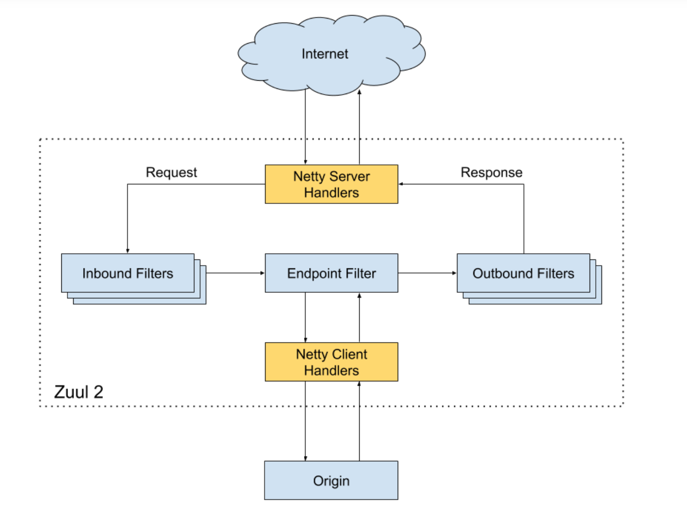
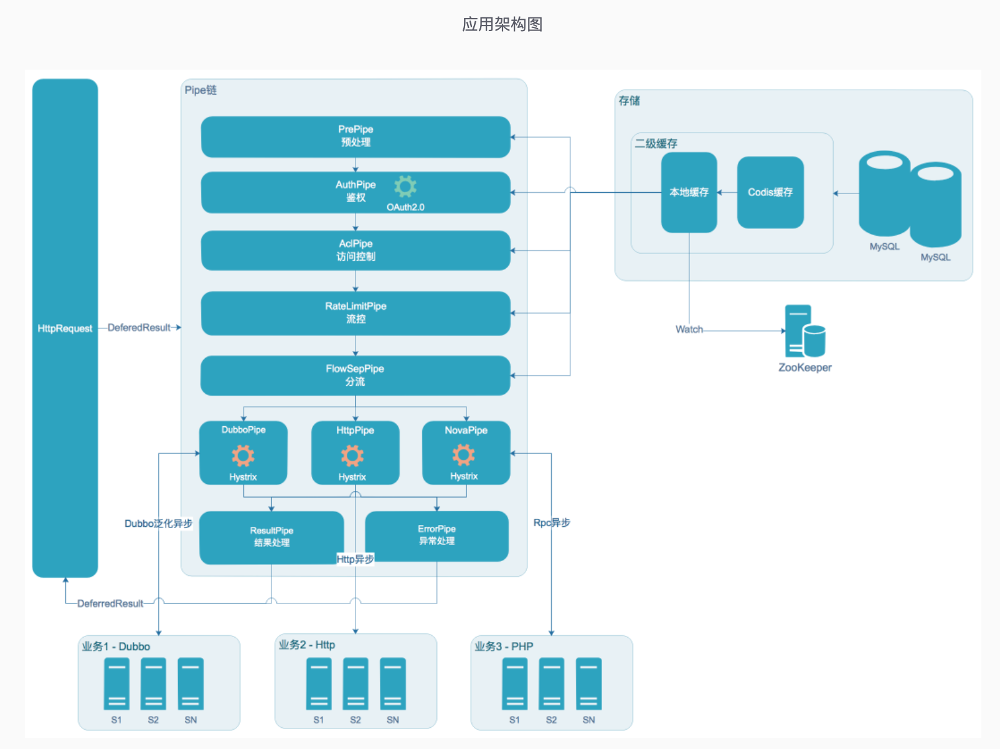

1、网关功能的介绍和结构    
2、常见的API网关    
3、    
4、    
5、    
    
    
    
---------------------------------------------------------------------------------------------------------------------    
    
网关功能的介绍和结构    
    
http://microservices.io/     
总结的微服务模式中，网关已经成为服务化中的一种标准模式。    
http://microservices.io/patterns/apigateway.html    
    
    
网关之降级、熔断、限流、隔离、幂等性验证的相关知识简单整理    
例如：鉴权、限流、ACL、降级等。    
重试机制，超时机制，    
流量转发、跨域、统计、日志、    
鉴权Token、签名校验、黑白名单（IP、Client应用）、路由、负载均衡、容灾切换    
网关注册中心（控制台）    
OA 鉴权中心    
沙箱测试、灰度    
    
    
    
网关生态主要包含控制台、网关核心、网关统计与监控    
控制台主要对API生命周期进行管理，以及ACL、流量管控等功能；    
网关核心主要处理API调用，包含鉴权、限流、路由、协议转换等功能；    
统计与监控模块主要完成API调用的统计以及对店铺、三方的一些报表统计，同时提供监控功能和报警功能    
    
    
制作网关项目的好处：    
（1）网关层对外部和内部进行了隔离，保障了后台服务的安全性。    
（2）对外访问控制由网络层面转换成了运维层面，减少变更的流程和错误成本    
（3）减少客户端与服务的耦合，服务可以独立发展。通过网关层来做映射。    
（4）通过网关层聚合，减少外部访问的频次，提升访问效率。    
（5）节约后端服务开发成本，减少上线风险。    
（6）为服务熔断，灰度发布，线上测试提供简单方案。    
（7）便于扩展。    
    
1. 应用场景    
假设服务A依赖服务B和服务C，而B服务和C服务有可能继续依赖其他的服务，继续下去会使得调用链路过长，技术上称1->N扇出。如果在A的链路上某个或几个被调用的子服务不可用或延迟较高，则会导致调用A服务的请求被堵住，堵住的请求会消耗占用掉系统的线程、io等资源，当该类请求越来越多，占用的计算机资源越来越多的时候，会导致系统瓶颈出现，造成其他的请求同样不可用，最终导致业务系统崩溃，又称：雪崩效应。    
    
    
2.处理方式    
降级：在服务器压力剧增的情况下，根据实际业务情况和流量，对一些服务和页面不处理或简单处理，从而释放服务器资源保证核心交易正常运作。    
熔断：熔断一般是指软件系统中，由于某些原因使得服务出现了过载现象，为防止造成整个系统故障，从而采用的一种保护措施，所以很多地方把熔断亦称为过载保护。    
限流：限制服务/接口访问的流量。可以从总量+速率进行处理    
隔离：保证其中某个服务坏掉，不会影响到其他服务。线程池/信号量隔离模式    
幂等性验证: 可能因为网络抖动或其他位置原因,服务端在短时间内可能会受到多笔相同的交易    
超时机制：一种是请求的等待超时，一种是请求运行超时。    
    
其中，降级、熔断、隔离属于出现问题后的处理机制。限流属于预防。    
    
a. 降级处理    
    
服务降级模式：屏蔽降级【直接关闭相关服务】、容错降级【根据异常进行返回处理】、业务降级【业务调整】、非降级【其他】；    
服务降级措施：返回NULL、抛出指定异常、调用本地MOCK服务、自定义降级策略。    
    
容错处理：DUBBO的容错策略    
相关连接：http://dubbo.apache.org/zh-cn/docs/user/demos/fault-tolerent-strategy.html    
    
    
    
    
网关的四个技术方向：    
    
1、统一接入，就是前端（包括 APP 或其他来源）的流量，都能在统一网络层进行接入。    
这一层所面临的问题是：高性能透传、高并发接入、高可效性，以及当前端流量来了之后，怎样能够进行一个负载的服务往后端的转发。    
    
2、流量管控，主要指流量治理部分。面对海量流量，我们怎样通过一些防刷技术，保障网关不被大流量冲垮；以及怎样通过一些像限流、降级、熔断等技术，对网关进行全方位保护。    
3、协议适配，就是前文提到的，网关会透传后端上千个服务，而这些服务一定不是每一个都需要网关去开发配置的。    
我们通过一个协议适配的转换，让后端的各种服务通过我们指定的协议、通过 HTTP 的方式从网关开放出去，当然网关不单单是 HTTP 协议，还有一些 TCP 的。    
    
京东内部的协议相对比较统一，有 HTTP 的 restful 的协议，也有 JSF 的接口，JSF 是京东内部自研的一个框架，一个 RPC 调用框架，和 Double 是类似的，然后基于注册发现的一个 RPC 框架。    
    
4、安全防护，这一部分对于网络来说非常重要，因为网关是整个公司对外的一个出口，在这一层我们要做一些防刷。    
比如防清洗一些恶意流量、做一些黑名单，当有一些恶意流量的话，通过限制 IP 等限制手段把它拒绝在整个网关之外，防止这些恶意流量把网关冲垮。    
    
    
自研网关架构    
我们的自研网关架构主要分为三层：    
1、接入层    
主要负责一些长短链接的接入、限流、黑白名单、路由、负载均衡、容灾切换等。这一层所采用的技术是 Nginx+lua 的方式。    
    
2、分发层    
这一层是分发层或者叫网关的业务层，它更多的是 NIO+Serviet3 异步的技术。    
    
3、泛化层中间有两块：    
    主动通知，就是我们会通过这种 TCP 的下行通道及时通知到客户端，发一些像京东账户优惠券或提醒等。    
    沙箱测试，主要是在一些接口发布上线之前，进行一个外部的测试。    
    
    
    
我们的网关系统所涉及到的一些技术栈：    
    接入层 Nginx+lua 技术。    
    NIO+Serviet3 异步技术。    
    分离技术。    
    降级限流。    
    熔断技术。    
    缓存，哪些地方该加缓存，哪些地方可以直接读库。    
    异构数据。    
    快速失败。    
    监控统计，这是整个高可用网关系统里非常重要的一部分。    
    
    
参考    
https://www.deathearth.com/838.html    
https://www.upyun.com/opentalk/335.html    
https://juejin.im/post/5bda67f26fb9a0223e4da611    
http://jm.taobao.org/2019/01/14/%E5%BE%AE%E6%9C%8D%E5%8A%A1%E7%94%9F%E6%80%81/    
    
---------------------------------------------------------------------------------------------------------------------    
    
常见的API网关    
1、Zuul1网关    
2、Zuul2网关    
3、Kong网关    
4、基于 Go 的 Tyk    
5、Spring Cloud Gateway    
    
6、有赞API网关、京东网关、唯品会、阿里    
7、Openresty + lua    
8、开源的能力开放平台参考    
    
    
    
对于 API Gateway，常见的选型有基于 Openresty 的 Kong、基于 Go 的 Tyk 和基于 Java 的 Zuul。    
    
    
    
Zuul1网关    
    
    
    
就像上图中所描述的一样，Zuul 提供了四种过滤器的 API，分别为前置（Pre）、后置（Post）、路由（Route）和错误（Error）四种处理方式。    
    
参考    
http://www.scienjus.com/api-gateway-and-netflix-zuul/    
https://blog.csdn.net/ityouknow/article/details/79215698    
    
    
    
微服务路由网关（zuul-plus）    
https://github.com/siaorg/sia-gateway    
    
    
    
Zuul2网关    
    
    
    
    
有赞API网关    
    
    
https://tech.youzan.com/api-gateway-in-practice/    
    
有赞服务回归验证平台 - 对比引擎    
https://tech.youzan.com/youzan-service-regression-test-platform/    
    
    
    
京东网关    
http://www.yunweipai.com/archives/23653.html    
    
    
    
唯品会API网关设计与实践    
https://mp.weixin.qq.com/s/gREMe-G7nqNJJLzbZ3ed3A    
    
    
    
    
开源的能力开放平台参考    
https://gitee.com/owenwangwen/open-capacity-platform    
    
    
    
---------------------------------------------------------------------------------------------------------------------    
    
    
    
    
---------------------------------------------------------------------------------------------------------------------    
    
    
    
    
    
---------------------------------------------------------------------------------------------------------------------    
    
    
    
